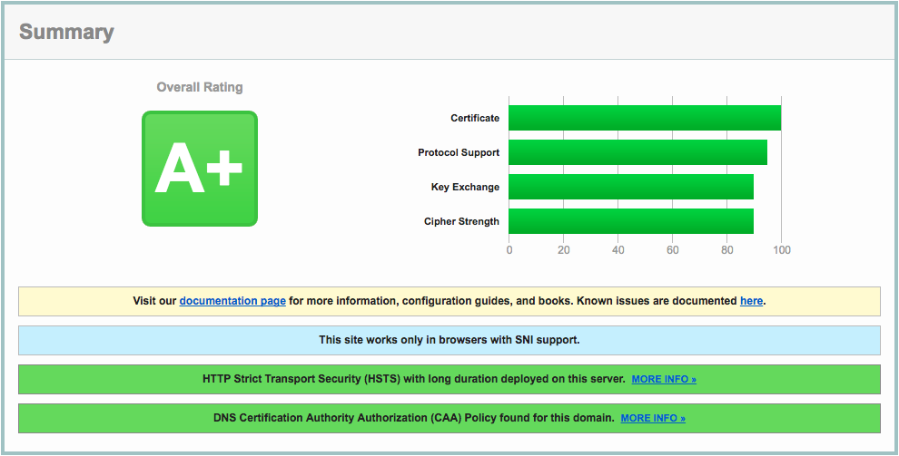

Ansible Nginx Passenger Role
============================

[](https://travis-ci.org/bbatsche/Ansible-Nginx-Passenger-Role) [](https://galaxy.ansible.com/bbatsche/Nginx)

This role will install Nginx server along with Phusion Passenger bindings for serving Node, Python, or Ruby. It can also setup and configure a site for a given domain.

Requirements
------------

This role takes advantage of Linux filesystem ACLs and a group called "web-admin" for granting access configuration directories. You can either configure those steps manually or install the [`bbatsche.Base`](https://galaxy.ansible.com/bbatsche/Base/) role.

Role Variables
--------------

- `env_name` &mdash; Whether this server is in a "development", "production", or other type of environment. Default is "dev"
- `http_root` &mdash; Where site directores should be created. Default is "/srv/http"
- `public_directory` &mdash; Publicly visible directory for site, eg "public" or "htdocs". Default is "public"
- `max_upload_size` &mdash; Maximum upload size in MB. Default is "10"
- `domain` &mdash; Domain name for site to create. Undefined by default.
- `nginx_configs` &mdash; Additional config files to add to the end of the domain's `server` block. These files should be copied to `/etc/nginx/conf.d`. Add configs for your particular application server type here. Default is an empty array
- `passenger_app` &mdash; Is the current domain a Passenger app (ie, Node, Ruby, Python)? Useful if the app needs to be restarted after updating configs. Default is no
- `copy_index` &mdash; Copy an index.html stub to the site. Default is no.
- `use_ssl` &mdash; Whether to serve content via SSL (really TLS). Default is no.
- `use_letsencrypt` &mdash; Whether to use [Let's Encrypt](https://letsencrypt.org/) to generate a certificate for a site. Otherwise a server wide self signed certificate will be used. Default is no.
- `privatekey_bits` &mdash; Number of bits to use when generating a self signed private key. Default is 4096.
- `dhparam_bits` &mdash; Number of bits to use when generating static DH param certificate. Default is 2048. Going much higher can be very time consuming.
- `cert_valid_days` &mdash; Number of days the self signed certificate will be valid for. Default is 3650 (~1 year).
- `email_address` &mdash; Email address to use for self signed certificate and Let's Encrypt. Undefined by default.
- `country_name` &mdash; Two letter country abbreviation to use when generating self signed certificate. Undefined by default.
- `state_name` &mdash; State or province name to use when generating self signed certificate. Undefined by default.
- `locality_name` &mdash; City or locality name to use when generating self signed certificate. Undefined by default.
- `org_name` &mdash; Organization name to use when generating self signed certificate. Undefined by default.
- `h5bp_commit` &mdash; Git hash to use for pulling files from [HTML5 Boilerplate Server Configs](https://github.com/h5bp/server-configs-nginx). Default is "c5c6602232e0976d9e69d69874aa84d2a2698265".

SSL & Let's Encrypt
-------------------

Let's Encrypt requires that your web server be externally accessable, therefore you should not use it when generating development sites in Vagrant or Docker. Furthermore, you must make sure your DNS is properly configured before creating your certificate. Once this is done, a fully supported and signed certificate will be issued for your domain, as well as a cron job to make sure it will continue to be renewed in the future. The server and certificate have been optimized for best possible security going forward, gaining an "A+" rating from [SSL Labs](https://www.ssllabs.com/ssltest/) as of October 2017.



Example Playbook
----------------

```yml
- hosts: servers
  roles:
     - { role: bbatsche.Nginx, domain: my-test-domain.test }
```

License
-------

MIT

Testing
-------

Included with this role is a set of specs for testing each task individually or as a whole. To run these tests you will first need to have [Vagrant](https://www.vagrantup.com/) and [VirtualBox](https://www.virtualbox.org/) installed. The spec files are written using [Serverspec](http://serverspec.org/) so you will need Ruby and [Bundler](http://bundler.io/).

To run the full suite of specs:

```bash
$ gem install bundler
$ bundle install
$ rake
```

The spec suite will target both Ubuntu Trusty Tahr (14.04) and Xenial Xerus (16.04).

To see the available rake tasks (and specs):

```bash
$ rake -T
```

These specs are **not** meant to test for idempotence. They are meant to check that the specified tasks perform their expected steps. Idempotency is tested independently via integration testing.
